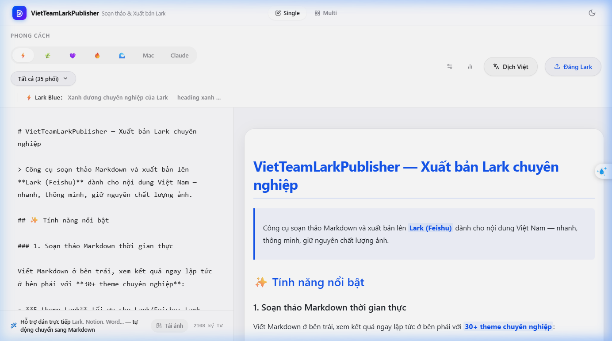

<div align="center">

# VietTeamLarkPublisher

**Công cụ soạn thảo & xuất bản Markdown lên Lark (Feishu) — nhanh, mượt, chất lượng cao.**

[](https://publish.raphael.app)
[](LICENSE)
[](https://react.dev)
[](https://typescriptlang.org)

</div>

---

## ✨ Tính năng chính

| Tính năng | Mô tả |
|-----------|-------|
| 📝 **Markdown Editor** | Editor thời gian thực với preview multi-device (mobile / tablet / PC) |
| 🎨 **30+ Themes** | 5 theme Lark chuyên dụng + 25+ theme phong phú |
| 🌐 **Dịch tự động** | Tích hợp Gemini, GPT-4, Claude — dịch song song toàn bộ bài viết |
| 🖼️ **Upload ảnh thông minh** | Tự động match ảnh với file md theo tên, dịch ảnh có chữ, không resize |
| 📤 **Đăng Lark 1 click** | Publish lên Lark Doc / Wiki, ảnh tự upload, H1 tự làm tiêu đề doc |
| 🗂️ **Multi-card mode** | Quản lý nhiều bài viết cùng lúc theo dạng dashboard |
| 📊 **Usage Stats** | Theo dõi chi phí API, số lần dịch, tốc độ theo từng card |

---

## 📸 Screenshot



---

## 🚀 Quick Start

```bash
# Install dependencies
pnpm install

# Start dev server
pnpm dev

# Build for production
pnpm build
```

---

## 🏗️ Tech Stack

- **React 18** + **TypeScript 5** + **Vite**
- **Tailwind CSS** + **Framer Motion**
- **markdown-it** + **highlight.js**
- **Electron** (Desktop app support)
- AI: **Gemini / OpenAI / Anthropic / 302.ai**

---

## 📋 Luồng hoạt động

```
Markdown Input
    ↓
Dịch (Gemini/GPT/Claude) — song song tất cả chunks
    ↓
Upload ảnh → imageStore (img:// keys, persist localStorage)
    ↓
Apply Theme → Preview
    ↓
Publish to Lark
  ├── H1 → Document title (tự động strip khỏi body)
  ├── Ảnh trong list → Image block (không bị mất)
  └── Ảnh lớn → chunk xử lý, không vượt 100k limit
```

---

## ⚡ Performance

- Translate: toàn bộ chunks **song song** (Promise.all)
- ImageStore: tách khỏi `markdownInput`, persist riêng → card save nhỏ gọn
- localStorage: **debounce** 800ms, không write mỗi keystroke
- Base64→Blob: `Uint8Array.from` (~10× nhanh hơn loop thủ công)
- Log cache: in-memory, flush debounce 200ms

---

## 📁 Project Structure

```
src/
├── components/        # UI components (Header, DashboardCard, ThemeSelector…)
├── lib/
│   ├── larkPublish.ts # Markdown → Lark blocks parser
│   ├── larkRunner.ts  # Publish orchestration (wiki + doc flow)
│   ├── translate.ts   # Multi-provider translation with parallel chunks
│   ├── imageStore.ts  # Persistent in-memory image store
│   ├── cardLog.ts     # Activity log with in-memory cache
│   └── themes/        # 30+ visual themes
└── App.tsx
electron/              # Electron main + preload (Desktop mode)
```

---

<div align="center">

Made with ❤️ by **VietTeam**

</div>
